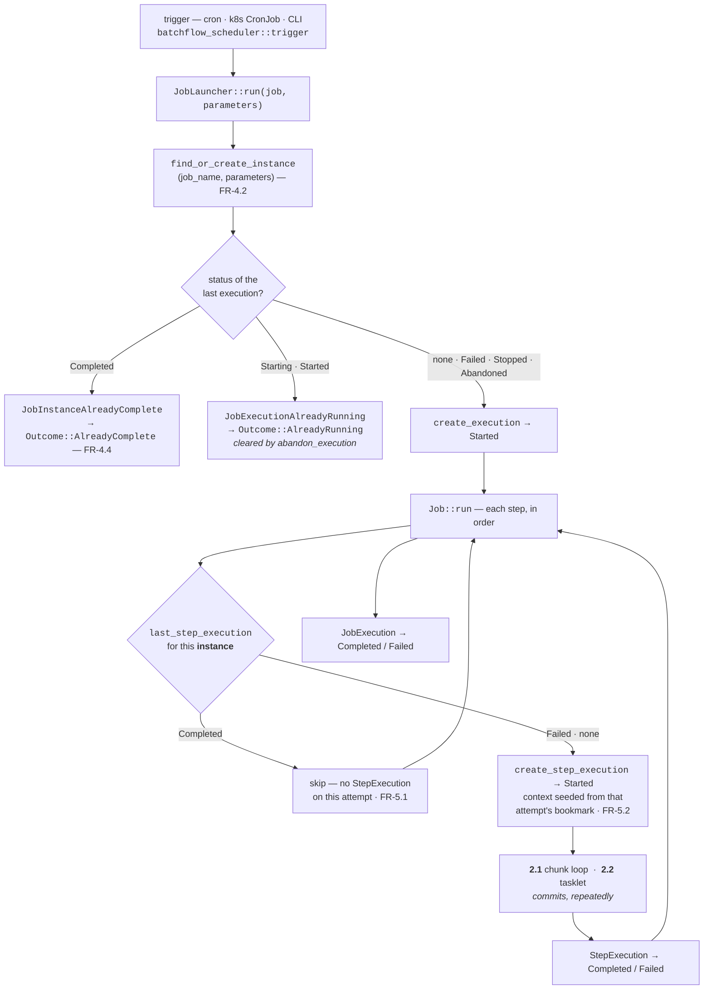

# BatchFlow — Architecture

> Status: **Living document.** Records the model, the crate layout, technology choices, and ADRs.
> Last updated: 2026-08-06 — §2.0 flow diagram, §2.2 tasklets, §4 as-built crate map, §5 tech-eval closed.

---

## 1. Architecture Overview

BatchFlow is **a durable state machine with a transactional inner loop**. Two things bolted together:

1. **Execution engine** — walks a Job's Steps; inside a chunk step runs a tight `read → process → write` loop.
2. **Metadata store (JobRepository)** — records every step of that walk so the machine can be killed and resumed.

Almost every "feature" is emergent from these two interacting:
- **Restartability** = the engine consulting persisted state before each move.
- **Fault tolerance** = policies perturbing the inner loop.
- **Observability** = instrumentation wrapped around the loop.

### The two families of domain objects

**Definitions (blueprint, immutable, in-memory, author-written):**
`Job`, `Step`, `ItemReader<I>`, `ItemProcessor<I,O>`, `ItemWriter<O>`.

**Executions (runtime facts, mutable, persisted, engine-written):**
`JobInstance` (identity = hash of `JobParameters`), `JobExecution` (one attempt),
`StepExecution` (one step attempt + counters), `ExecutionContext` (serializable bookmark bag).

> The **JobInstance vs JobExecution** distinction is what makes restart possible.
> `JobParameters` are the identity key: they decide "new instance" vs "restart of an existing one."

---

## 2. Execution Flow

### 2.0 The whole path, at a glance

Every decision the engine makes about *whether* to do work is a read from the
metadata store. That is the whole design in one picture: the two refusals and
the one skip below are the only branches, and all three are answered by rows,
not by flags in memory.



**Restart is not a branch on this diagram.** A fresh run is the same path with
every lookup returning `None`; the two lookups that make a restart a restart —
`last_execution` and `last_step_execution` — run identically either way. That is
why there is no `if restarting` anywhere in the engine, and why the property is
testable: `a_first_run_starts_every_step_from_an_empty_context`.

**Note where the transaction is not.** The launcher's gate (read the last
execution, then create one) is two statements outside any transaction, so two
processes racing an instance that has never run can still both launch. Narrow,
known, and recorded as debt (2) rather than claimed fixed.

### 2.1 The chunk loop (spine)

Spring Batch splits this across `TaskletStep` / `RepeatTemplate` / `ChunkOrientedTasklet` /
`ChunkProvider` / `ChunkProcessor`. BatchFlow collapses the Java loop-abstractions (`RepeatTemplate`)
into plain Rust `loop`s and keeps the meaningful seams (provide vs process, TX ownership).

```
Step (owns the transaction + StepExecution):
  loop (chunk loop):
    tx = repository.begin()                       # BEGIN
    // ---- read side (ChunkProvider) ----
    chunk = []
    while chunk.len() < commit_interval:           # NOT `for _ in 0..N`: a skipped
        match reader.read().await {                # read must not consume a slot,
            Ok(Some(i)) => chunk.push(i),          # or dirty input silently shrinks
            Ok(None)    => break,                  # the transaction
            Err(e)      => match fault.disposition(e, skipped) {
                Skip    => skipped += 1,           # FR-6.2; the limit also bounds
                Fail(e) => return Err(e),          # this loop against a reader
            },                                     # that never advances
        }
    if chunk.is_empty(): return DONE               # no transaction is open yet
    // ---- process side: ONCE, and OUTSIDE any transaction ----
    out = []
    for item in chunk:
        match processor.process(item).await {
            Ok(Some(o)) => out.push(o),            # None → filtered
            Ok(None)    => filtered += 1,
            Err(e)      => match fault.disposition(e, skipped) {
                Skip    => skipped += 1,           # FR-6.2, item dropped
                Fail(e) => return Err(e),
            },
        }
    let contribution = StepContribution { read, write, filter, skip }  # pending deltas
    // ---- write + commit: the retry scope (FR-6.1) ----
    loop {
        tx = commit.begin().await?                 # FRESH per attempt, never reused
        if let Err(e) = writer.write(&mut tx, &out).await {
            commit.rollback(tx).await?             # BEFORE the backoff, not after
            if fault.should_retry(&e, attempt) { sleep(backoff.next()); attempt += 1; continue }
            return Err(e)
        }
        reader.update(&mut context)                # bookmark, always before the commit
        match commit.commit(tx, &contribution, &context).await {
            Ok(())  => break,                      # COMMIT: data + metadata together
            Err(e)  => {                           # `commit` consumed tx — nothing to roll back
                if fault.should_retry(&e, attempt) { sleep(backoff.next()); attempt += 1; continue }
                return Err(e)
            }
        }
    }
```

**Load-bearing invariants:**
- **TX boundary = commit interval.** Bigger N ⇒ fewer commits, faster, but more re-done on crash + more memory/chunk.
- **StepContribution = pending deltas.** Counters fold in only just before commit, so rollback discards them cleanly. In Rust this is a plain owned struct — no shared mutable state.
- **Atomic bookmark.** Reader position is snapshotted into `ExecutionContext` in the *same* transaction as data + counters ⇒ restart cannot duplicate committed items.
- **Processing happens once, outside the transaction.** `process` consumes its item, so it *cannot* be re-run; the transaction therefore spans only write-and-commit. Side benefit: a processor making a 200 ms enrichment call per item no longer holds row locks for 200 seconds a chunk.
- **A retry opens a new transaction.** Enforced by the type system — `rollback(tx)`/`commit(tx)` take `Tx` by value, so the rolled-back one is gone. Reusing it would meet Postgres' `25P02` on every subsequent statement.

### 2.2 The tasklet — one unit of work `[BUILT — Phase 4]`

The other kind of step (FR-1.2). No items, therefore no commit interval to size;
truncating a staging table, archiving a file, calling a stored procedure.

```
TaskletStep::run:
  loop:
    tx = commit.begin()
    contribution = StepContribution::new()          # fresh: an errored pass
    match tasklet.execute(&mut tx, ctx, &mut contribution):   # folds nothing
        Err(e) => { commit.rollback(tx); return Err(e) }
        Ok(status) => {
            commit.commit(tx, &contribution, ctx)    # counters + bookmark + tx
            if status == Finished: return Ok(())
        }
```

Three things are load-bearing and each is a consequence of a signature, not a
preference:

- **`RepeatStatus::{Continuable, Finished}` exists so that "more work" gets a
  commit point.** A tasklet looping inside one `execute` call commits once at
  the end, and a crash before that loses all of it. Returning `Continuable`
  instead gives each pass its own transaction and its own durable bookmark, so a
  tasklet is restartable on exactly the same machinery a chunk step is. The cost:
  nothing bounds that loop, because there is no item count to bound it *with* —
  a tasklet that always returns `Continuable` runs forever. Documented, not
  guarded.
- **Two traits, `Tasklet` and `TransactionalTasklet<Tx>`, adapted by the same
  `Unmanaged<T>` newtype the writers use.** Identical reasoning to ADR-007: a
  blanket impl would overlap every direct one, and making non-transactional work
  visible at the call site is the point. It also means a tasklet written for
  `Tx = ()` drops into a `Job<PgTx>` unchanged.
- **No retry, no skip.** Skip is meaningless with nothing to drop. Retry would
  re-call `execute` on a tasklet that has already mutated its own state — which
  is exactly the "your code must be idempotent" obligation §2.1 avoids imposing
  on processors, reappearing here. A tasklet that wants to retry owns that
  decision, where it can see what it already did.

Counters still reconcile: a tasklet's committed `StepContribution` feeds the same
`batchflow_items_*` counters the chunk loop does, so
`sum(items_written_total) == sum(write_count)` holds for a job containing both.
Its skips carry `phase="tasklet"`, since a tasklet is opaque and has no
read/process/write distinction to attribute them to.

### Restart
Not special code. Load prior `JobExecution`; skip `COMPLETED` steps; hand the failed step's persisted
`ExecutionContext` back to its reader; resume the same loop. Engine can't distinguish "fresh at row 4000"
from "restart at row 4000" — the goal property.

### Fault tolerance as loop perturbations `[BUILT — Phase 10]`
Both policies are **error classification** — `Result<T, E>` plus a `Classifier`, never exceptions — and both are
opt-in per step through `ChunkStep::with_fault_tolerance(FaultTolerance)`. The default is `FailFast`.

**The signatures decide where each policy can attach**, and this is the single most useful thing Phase 10 taught:

| operation | signature | granularity | policy it can support |
|---|---|---|---|
| `read()` | `-> Result<Option<Item>, _>` | one item | **skip** |
| `process(item)` | takes `Self::In` **by value** | one item | **skip** (not retry — the input is consumed) |
| `write(tx, &[Item])` | **borrows** a slice | N items | **retry** (not skip — it names a chunk, not an item) |

- **Retry** wraps `begin → write → commit`, with `backon` supplying an exponential, jittered, capped schedule.
  The rollback happens *before* the sleep: waiting on an open transaction holds its row locks and its pooled
  connection for the whole delay, so backoff would amplify exactly the contention it exists to relieve.
- **Skip** applies to read and process, bounded by a **step-wide** limit — one bad row in each of a thousand chunks
  is a broken input file, which a per-chunk counter would call healthy. Past the limit the step fails with
  `SkipLimitExceeded`, carrying the item error as its source.
- **A write failure still cannot be skipped**, because it does not name an item ⇒ optional **chunk scanning**
  (one-at-a-time), FR-6.4. `[BUILT — Phase 10d]`, opt-in via `scan_on_write_failure`, off by default: for an
  `Unmanaged` writer the identifying pass really delivers, so a 1000-item chunk with one bad row sends roughly
  2000 items. FR-6 has no remaining gap.
- **Classification needs the cause, not the message.** The wrapping `BatchError` variants carry
  `Cause = Box<dyn Error + Send + Sync>`; stringifying a `sqlx::Error` at the boundary makes a deadlock and a
  `NOT NULL` violation indistinguishable. Backends supply their own `Classifier` (`PostgresClassifier` reads
  SQLSTATE); core never learns a SQLSTATE.

---

## 3. Core Traits (target shape)

```rust
// RPITIT with an explicit `+ Send` bound — see ADR-002a.
// Implementors still write plain `async fn`.
trait ItemReader    { type Item; fn read(&mut self) -> impl Future<Output = Result<Option<Self::Item>, BatchError>> + Send; }
trait ItemProcessor { type In; type Out; fn process(&mut self, item: Self::In) -> impl Future<Output = Result<Option<Self::Out>, BatchError>> + Send; }
trait ItemWriter    { type Item; fn write(&mut self, items: &[Self::Item]) -> impl Future<Output = Result<(), BatchError>> + Send; }
```

- `&mut self` reader — stateful cursor ⇒ **not shareable across threads** (parallelism ⇒ partition, don't share). Compile-enforced.
- Writer takes `&[Item]` — least-privilege; writer that needs ownership clones (its cost, not everyone's).
- Processor takes `item: In` by value — it transforms/consumes.

### Storage abstraction (trait-first, phased impls)
`JobRepository`, `ExecutionContextStore`, `CheckpointStore`, `LockProvider`, `MetricsExporter` — all traits.
Impl order: **InMemory → Postgres → Redis**. `[FUTURE]` SQLite, DynamoDB, Mongo.

**Where does the transaction live** in an async Rust `JobRepository`? `[DECIDED 2026-07-27 — see ADR-007]`
Answer: the repository owns it (`type Tx` + `begin`/`commit`/`rollback`), and writers *opt in* to enlisting via
`TransactionalWriter<Tx>`; plain `ItemWriter` impls are adapted with an `Unmanaged<W>` wrapper. Implemented in
Phase 11 against real Postgres, not against the InMemory fake.

---

## 4. Workspace Organization

Cargo workspace; core stays dependency-light, backends/observability are separate opt-in crates.

**As built.** Six crates, and the differences from the Phase 0 sketch are more
interesting than the similarities — three planned crates were not built, each
for a reason worth keeping.

| Crate | Purpose | MSRV | Why separate |
|---|---|---|---|
| `batchflow` | Facade — the crate a user depends on | 1.85 | Its dependency graph *is* a user's, so a doctest here cannot compile something a user cannot (see debt 4) |
| `batchflow-core` | Traits, domain types, `BatchError`, engine | 1.85 | Stable heart; 34 runtime deps |
| `batchflow-postgres` | PostgreSQL metadata store (sqlx) | 1.94 | Heavy dep, and sqlx 0.9's own MSRV must not become everyone's |
| `batchflow-redis` | Redis metadata store | 1.88 | Opt-in; correctness depends on `appendfsync always`, documented in the crate |
| `batchflow-metrics` | Prometheus exporter, buckets, `install()` | 1.85 | Holds bucket boundaries and `describe()` ordering. Note the `metrics` *facade* is a dependency of core itself — the emit points are inside the private chunk loop, so no external crate could reach them |
| `batchflow-scheduler` | `trigger` semantics + a `cron` adapter | 1.85 | 37 deps by default, 66 with `cron` — the engine is behind the flag |

**Planned and deliberately not built:**

| Crate | Why not |
|---|---|
| `batchflow-memory` | Zero deps, and core's own tests need the in-memory store. It lives in `batchflow-core` (ADR-007, amended) |
| `batchflow-tracing` | ADR-010. Measured: the layer alone is 39 crates, with `opentelemetry-otlp` 99, against core's 24 at the time. Once the exporter belongs to the application there is no content left, and shipping it would pin users to one `opentelemetry` minor — two semver-incompatible copies means two tracer providers and spans silently going nowhere |
| `batchflow-io` | No CSV/JSON/SQL readers ship yet. FR-3.4 is still open, and the crate should be created by the first reader that needs it, not before |
| `batchflow-testing` | The fakes are `#[cfg(test)]` in core; what backend authors need is the **contract**, which ships as `batchflow-core`'s `conformance` feature instead |

> **The general lesson, recorded because it kept recurring:** a planned crate is
> a hypothesis. Three of nine were falsified by measuring the dependency tree or
> by noticing the crate would have no content. `batchflow-metrics` survived the
> same scrutiny and is the control.

---

## 5. Technology Evaluation

Principle: **own orchestration, integrate everything else.** Selections and one-line rationale.

| Category | Selected | Alternatives considered | Rationale |
|---|---|---|---|
| Async runtime | **tokio** | async-std (waning), smol | De-facto standard, ecosystem gravity, mature. Keep it out of *core trait* signatures where possible. |
| Error (lib) | **thiserror** | anyhow (apps only), snafu | Libraries expose typed errors; `anyhow` is for bins. `thiserror` derives our `BatchError`. |
| Async traits | **native `async fn` in traits** | `async-trait` macro | Native is stable + zero-cost; use `async-trait` only where we need `dyn` object safety. See ADR-002. |
| Serialization | **serde** | — | Universal. Backs `ExecutionContext` + params. |
| DB | **sqlx** | diesel (sync/macro-heavy), sea-orm | Async-native, compile-checked queries, Postgres-first. |
| CSV | **csv** | — | Standard, fast, serde-integrated. |
| Filesystem | **tokio::fs** | std::fs (blocking) | Async-consistent. |
| CPU parallelism | **rayon** | — | For CPU-bound processors; bridge to async carefully. |
| Async streams | **futures / tokio-stream** | — | Reader-as-stream adapters. |
| Retry | **backon** | tokio-retry (less active) | Ergonomic backoff builder, async-first, maintained. We own *classification*; delegate *backoff*. |
| Scheduling | **integrate**: tokio-cron-scheduler / k8s CronJob / system cron | building our own | Non-goal to build a scheduler. `[DECIDED — Phase 14]` `batchflow-scheduler`; `tokio-cron-scheduler` behind the `cron` feature (37 → 66 deps). |
| Metrics | **metrics** (+ Prometheus exporter) | prometheus crate directly | Facade decouples us from exporter choice. |
| Tracing | **tracing** | log | Spans model job/step/chunk naturally. |
| OpenTelemetry | **opentelemetry** (+ tracing-opentelemetry) | — | Standard distributed tracing export. |
| Config | **none** | figment, config | `[DECIDED — Phase 14]` **No config crate.** Phase 14 was where this was to be settled, and building it settled it: a job is wired in Rust — `ChunkStep::new(..)`, `FaultTolerance::new().retry(..)` — and there is nothing left for a config file to carry that is not the application's own. A framework that read `batchflow.toml` would have to invent a registry mapping names to reader types, which is a plugin system nobody asked for. |
| CLI | **clap** | — | Standard; only for `examples`/tooling. |
| Time | **none** | chrono, time | `[DECIDED — Phase 14]` **No time crate in any BatchFlow crate.** The schema has no timestamps (which is *why* `abandon_execution` is an operator assertion — see 9a), and the one place a clock seemed unavoidable turned out to belong to the caller: the run key in `JobParameters` is built by whatever fired the schedule, from whatever calendar it uses. `chrono` appears in the lock file only as `tokio-cron-scheduler`'s own dependency, behind the `cron` feature, and no BatchFlow type mentions it. Revisit the moment a timestamp column lands in `job_execution`. |
| UUID | **none** | uuid | `[DECIDED]` Ids are `i64` newtypes minted by the store — a Postgres sequence, a Redis `INCR`. A UUID would buy client-side generation the engine never needs, and cost an index. |
| Testing | **proptest**, **testcontainers** | rstest | `[DECIDED]` proptest for the chunk-loop invariants (Phase 6), testcontainers for real Postgres and Redis. **rstest not adopted:** its value is parameterised cases, and the one place this suite needed them — the backend contract — is served better by the `conformance` macro, which generates the same 32 cases for *every* backend rather than for one test. |
| Benchmarking | **criterion** | — | Statistically sound; Phase 17. |

---

## 6. ADRs (Architecture Decision Records)

### ADR-001 — Collapse `RepeatTemplate`; the loop is a `loop`
**Context:** Spring Batch abstracts loops into `RepeatTemplate` objects (pre-lambda Java couldn't pass loop bodies).
**Decision:** Use plain Rust `loop`/`for`. Keep only the meaningful seams (read side vs process/write side, TX ownership).
**Consequences:** Less indirection, clearer control flow. We lose a pluggable "completion policy" object — acceptable; reintroduce as a small enum if needed.

### ADR-002 — Native `async fn` in traits; `async-trait` only for `dyn`
**Context:** Core traits are async. Native async-fn-in-traits is stable but has `dyn`/object-safety + auto-trait-bound caveats.
**Decision:** Prefer native for generic/`impl Trait` paths. Introduce `async-trait` (or manual boxing) only where trait objects are required (e.g. heterogeneous step lists, plugin readers).
**Consequences:** Zero-cost in the hot path; localized macro use where dynamism is genuinely needed. Revisit if RPITIT ergonomics change.

#### ADR-002a — Amendment: the framework is `Send` `[DECIDED 2026-07-27]`
**Context:** The original decision used `#[async_trait(?Send)]` for `Step`, which made `Job::run()`'s future non-`Send`. Consequence discovered by compiling an assertion: **`tokio::spawn(job.run())` did not compile** — jobs were locked to a current-thread runtime. `#[tokio::test]` defaults to current-thread, so no test caught it.

**Decision:** `Send` is a framework-wide requirement.
1. `Step: Send` supertrait + `#[async_trait]` (not `?Send`). `Box<dyn Step>` is then `Send` for free — no `+ Send` at use sites.
2. The three core traits keep native async but declare the bound explicitly via **RPITIT**: `fn read(&mut self) -> impl Future<Output = ..> + Send`. The `async fn` sugar desugars to an *unnameable* associated future type, so `R: ItemReader + Send` cannot constrain it — writing the return type by hand is the only way to say `+ Send`. Implementors are unaffected and still write `async fn`.
3. `#[allow(async_fn_in_trait)]` is removed from all three traits — that lint exists precisely to flag the unbounded-future hole this closes.
4. The same rule applies to every future trait, notably `JobRepository` (Phase 7).

**Consequences:** Jobs are spawnable and multi-threaded-runtime-safe. Cost: implementors' futures **must** be `Send` — an `Rc`/`RefCell`-based reader will not compile. Accepted deliberately; if a non-`Send` variant is ever needed, generate both with the `trait_variant` crate rather than forking the traits by hand. Auto-traits are SemVer-visible and silently lost, so `job_run_future_is_send` asserts this at compile time in the test suite.

### ADR-003 — Associated types over generic type params on core traits `[DECIDED 2026-07-24]`
**Context:** `ItemReader<I>` (generic) vs `trait ItemReader { type Item; }` (associated).
**Rule applied:** Generic param = *input* type the caller chooses, multiple coexist per impl (`From<T>`). Associated type = *output* type the impl determines uniquely, functional dependency `Self → Item` (`Iterator::Item`). A reader/processor/writer produces/consumes exactly one type per impl ⇒ output ⇒ associated.
**Decision:** Associated types on all three core traits. `ItemProcessor` gets two (`In`, `Out`) — both are outputs of the impl.
**Consequences:** (1) Compiler enforces "a reader reads one thing" (second impl = conflict error). (2) Inference flows: `read_chunk<R: ItemReader>() -> Vec<R::Item>` needs no turbofish. (3) Step type-wiring is 3 equality bounds (`P: ItemProcessor<In = R::Item>`, `W: ItemWriter<Item = P::Out>`) instead of 4 viral generic params threaded everywhere. (4) Write-anything polymorphism (e.g. JSON) lives on the concrete type via `impl<T: Serialize> ItemWriter for JsonWriter<T> { type Item = T; }` + `PhantomData<T>`, NOT on the trait — keeps the guarantee and the ergonomics.

### ADR-004 — Errors: typed `BatchError` via thiserror, `#[non_exhaustive]`
**Context:** Need retry/skip classification without exceptions.
**Decision:** `BatchError` enum, `#[non_exhaustive]`, derived with thiserror; classification via a trait mapping errors → {Retryable, Skippable, Fatal}.
**Consequences:** Explicit, SemVer-safe growth. Classification is user-overridable.
**Amended 2026-07-30 (Phase 10a):** the wrapping variants (`Read`/`Write`/`Process`/`Repository`) carry
`pub type Cause = Box<dyn Error + Send + Sync + 'static>` under `#[source]`, not a `String`. A stringified error is
a tombstone — it proves a failure happened and destroys everything a classifier needs. Construction goes through
`BatchError::read/write/process/repository(impl Into<Cause>)`, which accepts a `&str`, a `String` or any concrete
error, so callers never spell the box and backends can pass the real error through. Domain variants
(`JobInstanceAlreadyComplete`, `CannotAbandon`, `SkipLimitExceeded`, …) stay structured: they exist for callers who
branch, and a `String` payload is only ever for wrapping a foreign error.

### ADR-005 — Storage is trait-first; InMemory is the reference impl
**Context:** Must not couple to Postgres.
**Decision:** Define `JobRepository` (+ friends) as traits; ship `batchflow-memory` first, then Postgres, then Redis.
**Consequences:** Fast tests, clean SPI. The hard open problem is transaction ownership across writer + repository (ADR pending, Phase 7).

### ADR-006 — Scheduling is integration, not an engine `[DECIDED — BUILT Phase 14]`
BatchFlow exposes a launch API; external schedulers trigger it. No home-grown cron engine.

**What building it revealed.** The missing piece was much smaller than "adapters", and it was not
plumbing: it was a *classification*. `JobLauncher::run` reports "this instance already completed"
and "another execution is still running" as `BatchError`s — correct for a caller that asked for a
run, and wrong for a schedule, to which both are the system working. A nightly job whose 03:00 run
is still going at 04:00 must not start twice; a re-fired tick must be a no-op. `trigger` turns those
two errors into `Outcome`s and leaves every other error alone, and that is the whole crate's
substance. Everything else — cron parsing, missed-tick policy, leader election — belongs to
Kubernetes or systemd, which already do it.

**The corollary is that the run key is the real API.** Deriving `JobParameters` from the tick
(`date=2026-08-06`) is what makes a schedule idempotent, because FR-4.2 identity then does the
deduplication. Constant parameters give a job that runs once ever; parameters containing a timestamp
give one with no deduplication and no restart, since every attempt is a new instance. Neither is what
a schedule wants, and neither is something the framework can detect — so it is documented at the
crate root, where the person choosing is reading.

**One new metric, `batchflow_triggers_total{job,outcome}`,** because a refusal creates no
`JobExecution` at all: a schedule that has been refused every night for a week emits *nothing* in the
core vocabulary, and the silence is indistinguishable from a healthy deployment.

### ADR-007 — Transaction ownership: opt-in transactional writer `[DECIDED 2026-07-27]`
**Context:** §2's chunk loop promises data + metadata + bookmark commit atomically (FR-2.4), which is what makes restart non-duplicating (FR-5.3). But `ItemWriter::write(&mut self, items)` has no access to a transaction, so as written the promise is unachievable — the writer commits independently of the repository.

**Options considered:**
- **(A) `tx` in every writer** — `write(&mut self, items, tx: &mut Tx)`. Atomic by construction, but `Tx` becomes a viral generic across `ItemWriter`/`ChunkStep`/`Step`/`Job`, and non-transactional writers (CSV, S3, stdout) must accept a transaction they cannot use.
- **(B) Repository owns its own tx** — simplest trait, but data and metadata commit separately ⇒ at-least-once only; FR-2.4/FR-5.3 downgrade from guarantees to best-effort.
- **(C) Opt-in transactional writer** — chosen.

**Decision:** `JobRepository` gains an associated `type Tx` plus `begin`/`commit`/`rollback`. Writers that *can* enlist in the step's transaction implement `TransactionalWriter<Tx>`; plain `ItemWriter` impls are unaffected and are adapted explicitly via an `Unmanaged<W>` wrapper. Exactly-once where the backend supports it, honest degradation where it doesn't.

**Consequences:**
- Two writer traits instead of one. The obvious blanket `impl<W: ItemWriter, Tx> TransactionalWriter<Tx> for W` is **not possible** — it would overlap with any direct impl, and Rust cannot prove a type doesn't implement `ItemWriter` (no negative reasoning without specialization). Hence the explicit `Unmanaged<W>` newtype: different `Self` type ⇒ no coherence conflict.
- `JobRepository` is used as a *generic* parameter (`R: JobRepository`), not `Box<dyn>`. There is exactly one repository per job — heterogeneity is what justifies `dyn` (as for `Step`), and it is absent here. This also sidesteps having to name `Tx` in a trait-object type.
- Per ADR-002a, `JobRepository: Send + Sync` and its futures are `+ Send`.

**Implementation is deferred to Phase 11**, when a real sqlx backend exists. Rationale: an InMemory repository has no transactions and will satisfy *any* `begin`/`commit` shape, including a wrong one — validating a transaction abstraction against a fake is how it ends up wrong. Phase 7b therefore ships metadata CRUD + identity dedup only, with no `Tx` in the trait yet. Adding it is a breaking change, which is free pre-0.1.0.

**Amends ADR-005:** the InMemory repository lives in `batchflow-core` rather than a separate `batchflow-memory` crate — it needs zero extra dependencies and core's own tests depend on it, which a separate crate would turn into a dev-dependency cycle. Revisit if it grows non-trivial.

---

## 7. Extensibility (SPI surface)

Users/extenders implement: `ItemReader`, `ItemProcessor`, `ItemWriter`, `JobRepository` (+ stores),
error `Classifier`, listeners. Everything else is internal orchestration. New backends/readers = new crates,
no core changes. This is the "own the orchestration, not every component" principle in practice.

### ADR-008 — Fault tolerance is configured per step, as one value `[DECIDED 2026-07-30]`
**Context:** Phase 10 needed somewhere to hang a classifier, a retry policy and a skip limit. Spring puts them on a
fault-tolerant step builder; the question was the Rust shape.

**Decision:** one `FaultTolerance` struct (`Box<dyn Classifier>` + `RetryPolicy` + `skip_limit`), held by
`ChunkStep`, set with `with_fault_tolerance(FaultTolerance)`.

**Consequences:**
- **`Box<dyn Classifier>`, not a generic parameter.** The `dyn`-vs-generic rule in this codebase is call frequency:
  boxing once per *error* is free, boxing once per *item* would be millions of allocations. It also keeps
  `ChunkStep<R, P, W>` from growing a fourth parameter that `new()` could not infer.
- **The setter takes the whole struct, not `(policy, classifier)`.** Skip arrived after retry and both need the
  classifier; two setters each owning it would mean calling the second silently resets the first. When two
  parameters are one decision, pass the decision.
- **Cost:** `FaultTolerance` has no `Debug` (a trait object cannot derive one), which keeps `ChunkStep` from
  satisfying API guideline C-DEBUG. The fix when it matters is a manual impl printing the policy and `<classifier>`,
  not a `Debug` supertrait on `Classifier` — that would tax every user impl for a diagnostic.
- **`RetryPolicy::attempts` takes `NonZeroU32`**, for the same reason `chunk_size` is `NonZeroUsize`: zero attempts
  would skip the write and report the chunk done.
- **The backoff schedule is unbounded**, leaving `should_retry` as the only authority on attempt count. Encoding the
  limit twice is worse than once, because the two fail differently — exceeding `should_retry` stops the retry, while
  exhausting the schedule would skip the *sleep* and keep going.

### ADR-009 — A failure during cleanup is reported *beside* its cause, not instead of it `[DECIDED 2026-07-31]`
**Context:** three lifecycle sites wrote `cleanup().await?` before propagating an outcome — the launcher's terminal
`update_execution`, `Job::run`'s terminal `update_step_execution`, and `run_step`'s `commit.rollback`. Rust has no
`finally`, so that `?` returns the *cleanup* error and silently drops the failure being cleaned up after. A job that
died on a bad row would report "repository failed", with the bad row nowhere in the message.

**Decision:** a `BatchError::CleanupFailed { cause, during_cleanup }` variant plus
`BatchError::with_cleanup(self, Result<(), BatchError>)`. The primary failure stays the `#[source]`; the cleanup
failure is preserved alongside it. An `Ok` cleanup returns the cause untouched, so call sites read identically either
way.

**Why not simply keep the primary and drop the cleanup error?** Because the two demand different responses and only
one of them is about the job. The cause says what to fix. A failed terminal status write means the metadata store
still reads `Started`, so the next launch is refused with `JobExecutionAlreadyRunning` and needs an operator to call
`abandon_execution`. Dropping it would hide an operational decision someone has to make.

**Why not log it and propagate only the cause?** That was the original plan (deferred to Phase 13 for a logger), but
it makes the recovery path depend on whether anyone configured a subscriber. Putting both in the returned value means
a caller that branches on errors can see both without reading a log.

**Consequences:**
- **Classification is unaffected, because the *cause* is the `#[source]`.** A `Classifier` walking `source()` reaches
  the original backend error, not the rollback that happened because of it. Verified by walking a real chain rather
  than assuming: note the chain node is a `Box<BatchError>`, so `source()`-walking to a concrete backend error works
  while a mid-chain `downcast_ref::<BatchError>()` would need the boxed type.
- **A failed rollback does not retry.** `run_step` returns instead: a transaction whose rollback failed is in an
  unknown state, and retrying on it is worse than failing.
- **Nesting is possible and correct.** If both a step's and its job's status writes fail, each layer records its own,
  and the innermost cause is still the step's error. Verbose when the whole store is down; accurate always.
- **Metrics stay consistent with the store**: the terminal counters are emitted only when the status write succeeded,
  so a metric never claims a status the repository never recorded.

### ADR-010 — No `batchflow-tracing` crate; the engine ships a vocabulary, the application owns the pipeline `[DECIDED 2026-08-03]`
**Context:** `Plan.md` Phase 13 promised a `batchflow-tracing` crate for OTel export, by analogy with
`batchflow-metrics`. That plan was written in Phase 0, before either existed. Once the spans and events were built,
the analogy did not hold.

**Decision:** there is no `batchflow-tracing` crate. `batchflow_core::tracing` exports the span-name and field-key
vocabulary; wiring an exporter is documented in the facade's rustdoc and left to the application.

**Why — three reasons, in increasing order of importance.**
1. **The exporter is the dependency trap 12d already solved.** Measured, not estimated:
   `tracing-opentelemetry` + `opentelemetry` + `opentelemetry_sdk` is **39 crates**; adding `opentelemetry-otlp`
   takes it to **99**, pulling hyper, prost, tower and the http stack. `batchflow-core`'s entire runtime tree is 24.
   12d's answer was that `render()` returns a `String` and routing it is the application's job; the same answer
   applies, so the crate could at most ship a `Layer`.
2. **Once the exporter is gone, there is no content left.** `batchflow-metrics` earns its existence by holding real
   decisions — the histogram bucket boundaries, and calling `describe()` *after* `install_recorder()`. Sampling was
   the candidate here, and 13b removed the need for it: with chunk spans deliberately rejected, a ten-step job emits
   **eleven spans per run**. What remains is `tracing_opentelemetry::layer().with_tracer(tracer)`.
3. **Shipping it would actively break users.** `tracing-opentelemetry` 0.33 is hard-paired to `opentelemetry` 0.32,
   and the OTel Rust ecosystem bumps majors roughly quarterly. A user on `opentelemetry` 0.31 who added our crate
   would get two semver-incompatible copies of `opentelemetry` in one binary — and therefore **two global tracer
   providers**. Our layer would register with one while their exporter installed into the other, and spans would go
   nowhere, silently, with everything compiling. `batchflow-metrics` documents its Prometheus coupling and accepts
   it because that crate carries value in exchange; here the exchange is fifteen lines of glue.

**Consequences:**
- **The deliverable is the vocabulary, not the transport** — the tracing counterpart of 12a. `SPAN_JOB`/`SPAN_STEP`
  and the `FIELD_*` keys are what an operator writes queries against, and a rename is now a visible change.
- **`tracing` field names cannot be constants, and the failure is silent.** `tracing`'s macros take a field name as
  an *identifier*: `warn!(FIELD_PHASE = "read")` compiles and emits a field literally named `FIELD_PHASE`. Span
  names *are* evaluated as expressions, so `info_span!(SPAN_JOB, ..)` is correct and is used. Verified by probe in
  both directions rather than assumed. Field literals in the engine are therefore bound to the module **only by
  tests**, which is why the 13b assertions were rewritten to use the constants.
- **Revisit if OTel Rust reaches 1.0**, at which point the version-pinning objection expires and a thin layer crate
  might be worth its maintenance. Nothing else about the decision would change.
